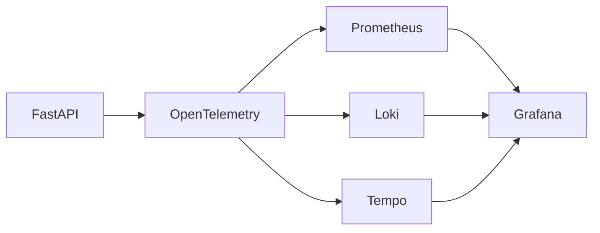
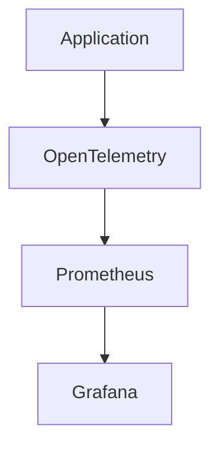
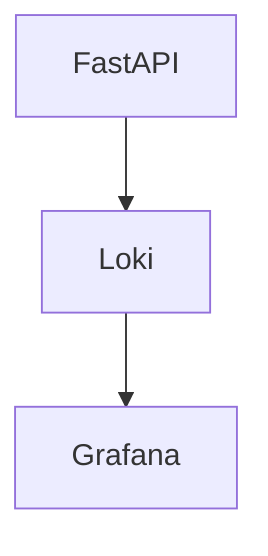
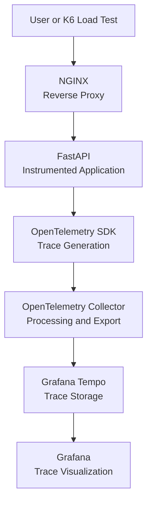

# Observability-Engineering-Framework

Final Project for the Undergraduate Degree in Computer Engineering, developing an Observability Engineering Framework using only open-source software and low-cost hardware.

# Open Source Observability Framework Lab

A practical observability framework built with OpenTelemetry,
Prometheus, Grafana, Loki and Tempo.

This project was developed as part of a Computer Engineering
research project focused on reliability engineering,
telemetry and distributed systems observability.

## Why?

Modern distributed systems generate huge amounts of telemetry.

This project demonstrates how an engineer can build a complete
observability stack using only open source technologies and
commodity hardware.

## Stack

- Python
- FastAPI
- OpenTelemetry
- Prometheus
- Grafana
- Loki
- Tempo
- Linux Ubuntu Server LTS
- NGINX
- K6
- Stress-NG

## General and Specific Objectives:

- Configure an experimental environment based on a Mini PC (focus on low-cost hardware) and the Linux Ubuntu Server LTS operating system;
- Develop and instrument a back-end application using FastAPI and OpenTelemetry;
- Integrate Prometheus, Grafana, Loki and Tempo for collecting, processing and analyzing telemetry signals;
- Execute load tests using K6 and chaos experiments with Stress-NG;
- Evaluate the system's behavior based on previously defined SLI indicators and SLO targets.

# Telemetry

Telemetry is the process of collecting and transmitting operational data from systems for monitoring, analysis and decision making.

Examples:

- Metrics
- Logs
- Traces

---

## Metrics

Metrics are numerical measurements collected over time.

Examples:

- CPU Usage
- Memory Usage
- Request Rate
- Error Rate

---

## Logs

Logs record events occurring in systems and applications.

Use Cases:

- Troubleshooting
- Auditing
- Root Cause Analysis

---

## Traces

Traces follow a request through distributed systems.

Components:

- Trace
- Span

Benefits:

- Performance Analysis
- Dependency Mapping
- Root Cause Investigation

---

## Service Objectives

- Latency P95 < 200ms;
- Error Rate < 1%;
- Availability > 99%;
- CPU Usage < 80%.

## Experimental Environment:

- Hardware: Intel Core i7 Mini PC, operating as a local server (NGINX);
- Operating System: Compatible Linux distribution (Ubuntu Server LTS);
- Back-end Application: API developed in Python using FastAPI;
- Telemetry Layer: Instrumentation with OpenTelemetry SDK;
- Observability Services:
  - Prometheus (metrics collection);
  - Grafana (visualization);
  - Loki (log storage);
  - Tempo (distributed traces);
  - OpenTelemetry Collector (routing and standardization of telemetry).
- Testing Tools:
  - K6 (load testing);
  - Stress-NG (chaos engineering with overload testing).

---
## Roadmap:

- PHYSICAL ENVIRONMENT PREPARATION:

- [X] Installation of the Linux operating system on the Mini PC;

- [X] Network configuration, permissions, and working directories.

- OBSERVABILITY ECOSYSTEM CONFIGURATION:

- [ ] Deployment of Prometheus, Grafana, Loki, and Tempo;

- [ ] Configuration of basic dashboards in Grafana;

- [ ] Creation of scraping jobs in Prometheus.

- TEST APPLICATION DEVELOPMENT:

- [ ] Implementation of a back-end service with FastAPI;

- [ ] Definition of routes, handlers, and representative operations;

- [ ] Packaging and execution of the application.

- INSTRUMENTATION WITH OPENTELEMETRY:

- [ ] Addition of tracing middleware, metrics, and logs;

- [ ] Export to OpenTelemetry Collector;

- [ ] Standardization of the OTLP format.

- LOAD TESTING AND METRICS COLLECTION:

- [ ] Execution of test scenarios on K6 (low, medium, and high load);

- [ ] Recording of latency, throughput, errors, and saturation.

- CHAOS ENGINEERING EXPERIMENTS:

- [ ] Application of CPU, memory, and network stressors with Stress-NG;

- [ ] Observation of the impact on SLIs.

- RESULTS ANALYSIS:

- [ ] Integrated visualization of telemetry in Grafana;

- [ ] Comparison with defined SLO targets;

- [ ] Interpretation of system behavior.

---

