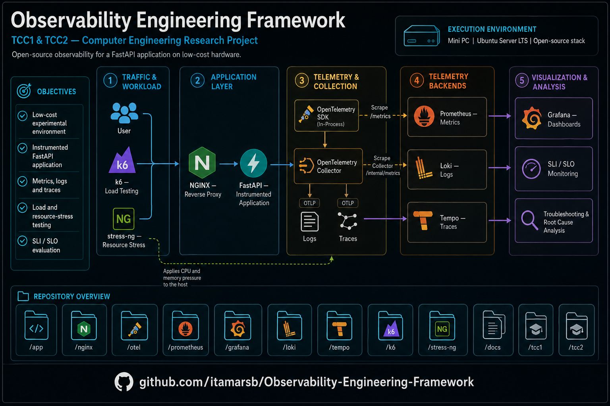
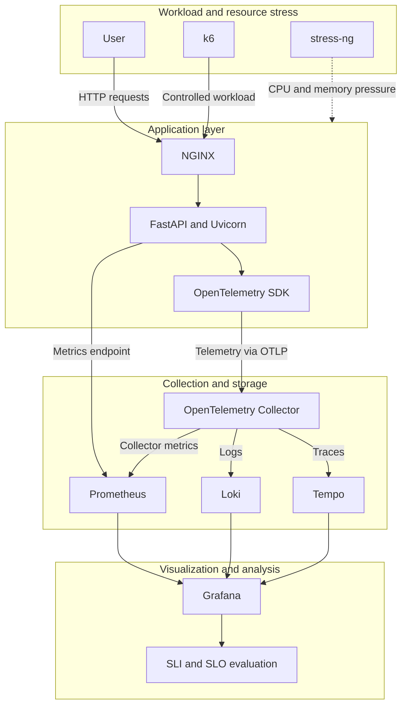

<div align="center">



# Observability Engineering Framework

**An open-source observability laboratory for metrics, logs, traces, workload testing, and controlled resource-stress experiments.**

</div>

---

## About the project

The Observability Engineering Framework is the final project of an undergraduate degree in Computer Engineering.

Its purpose is to design, implement, and evaluate an observability environment using open-source technologies and low-cost hardware.

The framework is being developed on a Mini PC running Ubuntu Server LTS. It will use an instrumented FastAPI application as the experimental workload and integrate metrics, logs, and traces through an observability stack composed of OpenTelemetry, Prometheus, Grafana, Loki, and Tempo.

Controlled experiments will be conducted with k6 and stress-ng to evaluate application behavior under different workload levels and resource-pressure conditions.

> This repository is under active development. Components marked as planned in the roadmap may not yet be implemented or operational.

---

## Project objectives

### General objective

Develop an open-source observability engineering framework capable of collecting, correlating, visualizing, and analyzing metrics, logs, and traces in a controlled experimental environment.

### Specific objectives

- Prepare a reproducible laboratory environment using low-cost hardware and Ubuntu Server LTS.
- Develop and test a back-end application using Python and FastAPI.
- Configure NGINX as a reverse proxy for the application.
- Instrument the application using OpenTelemetry.
- Collect and store metrics with Prometheus.
- Collect structured logs and store them in Loki.
- Collect distributed traces and store them in Tempo.
- Correlate telemetry signals through Grafana.
- Define service-level indicators and experimental service-level objectives.
- Generate controlled HTTP workloads with k6.
- Generate CPU and memory pressure with stress-ng.
- Evaluate latency, availability, throughput, error rate, and resource utilization.
- Document the experimental methodology, results, limitations, and conclusions.

---

## Current status

The physical laboratory environment has been prepared, and the repository structure has been created.

| Component | Status |
|---|---|
| Ubuntu Server installation | Completed |
| Network configuration | Completed |
| SSH access | Completed |
| System updates | Completed |
| Repository structure | Completed |
| FastAPI application | Planned |
| Automated application tests | Planned |
| NGINX configuration | Planned |
| Prometheus metrics | Planned |
| OpenTelemetry instrumentation | Planned |
| Loki log aggregation | Planned |
| Tempo trace storage | Planned |
| Grafana dashboards | Planned |
| k6 workload scenarios | Planned |
| stress-ng resource-stress scenarios | Planned |
| Experimental execution | Planned |
| Results analysis | Planned |

---

## Technology stack

### Application and operating environment

- Ubuntu Server LTS
- Python
- FastAPI
- Uvicorn
- NGINX
- systemd

### Observability

- OpenTelemetry SDK
- OpenTelemetry Collector
- Prometheus
- Grafana
- Loki
- Tempo

### Testing and experimentation

- pytest
- Postman
- Newman
- k6
- stress-ng

---

## Telemetry signals

The framework focuses on the three primary observability signals.

### Metrics

Metrics provide numerical measurements of application and infrastructure behavior over time.

Planned measurements include:

- Request rate
- Error rate
- Request latency
- P95 and P99 latency
- Application availability
- Throughput
- CPU utilization
- Memory utilization

### Logs

Structured logs will provide contextual information about application and infrastructure events.

Planned use cases include:

- Request analysis
- Error investigation
- Operational troubleshooting
- Event correlation
- Root cause analysis

### Traces

Distributed traces will represent the path and duration of requests processed by the instrumented application.

Planned trace information includes:

- Trace ID
- Span ID
- Parent span
- HTTP route
- Request duration
- Response status
- Application attributes
- Error information

---

## Planned architecture

The following diagram represents the target architecture. It does not indicate that every component has already been implemented.



---

## Planned telemetry flow

| Signal | Source | Collection | Storage and query | Visualization |
|---|---|---|---|---|
| Metrics | FastAPI and Collector | Prometheus scraping | Prometheus and PromQL | Grafana |
| Logs | FastAPI and NGINX | OpenTelemetry Collector | Loki and LogQL | Grafana |
| Traces | Instrumented FastAPI application | OpenTelemetry Collector | Tempo and TraceQL | Grafana |

The exact telemetry pipelines may be adjusted during implementation and validation.

---

## Preliminary SLI and SLO targets

The following values are initial experimental targets. They are not production guarantees and may be refined after the baseline measurements.

| Indicator | Preliminary target |
|---|---|
| Availability | Greater than or equal to 99% during each test window |
| Error rate | Less than 1% |
| P95 latency | Less than 200 ms |
| CPU utilization | Less than 80% under the defined baseline workload |

Each target will be evaluated within a documented workload scenario and measurement window.

---

## Experimental environment

### Hardware

- Mini PC used as a local laboratory server
- Intel Core i7-2600
- 16 GB RAM
- 480 GB SSD

### Operating system

- Ubuntu Server LTS

### Network and access

- Local network connectivity
- Static IP configuration
- SSH remote administration

Detailed installation evidence is available in:

- [Ubuntu Server installation notes](docs/lab-notes/ubuntu-server-installation.md)

---

## Experimental methodology

The planned experimental process consists of the following stages:

1. Establish a baseline under normal operating conditions.
2. Execute controlled workloads with k6.
3. Apply CPU and memory pressure with stress-ng.
4. Collect metrics, logs, and traces.
5. Repeat each scenario under equivalent conditions.
6. Export and process the collected results.
7. Compare measurements with the preliminary SLO targets.
8. Analyze correlations among telemetry signals.
9. Document findings, limitations, and conclusions.

The experimental matrix will be maintained in:

- [`experiments/experimental-matrix.md`](experiments/experimental-matrix.md)

> stress-ng is used to generate controlled resource pressure. It is not presented in this project as a complete chaos-engineering platform.

---

## Repository structure

```text
Observability-Engineering-Framework/
├── .gitignore
├── CITATION.cff
├── LICENSE
├── README.md
├── app/
│   ├── main.py
│   ├── requirements.txt
│   └── tests/
├── config/
│   ├── grafana/
│   ├── loki/
│   ├── nginx/
│   ├── otel-collector/
│   ├── prometheus/
│   └── tempo/
├── docs/
│   ├── architecture/
│   ├── images/
│   ├── lab-notes/
│   ├── methodology/
│   ├── runbooks/
│   └── troubleshooting/
├── experiments/
│   ├── k6/
│   ├── scenarios/
│   ├── stress-ng/
│   └── experimental-matrix.md
├── results/
│   ├── charts/
│   ├── processed/
│   ├── raw/
│   └── README.md
├── scripts/
└── tcc/
    ├── tcc1/
    └── tcc2/
```

---

## Implementation roadmap

### 1. Repository foundation

- [x] Prepare the Ubuntu Server environment.
- [x] Configure network access and SSH.
- [x] Install operating system updates.
- [x] Create the initial repository structure.
- [x] Correct the project metadata and documentation.

### 2. FastAPI application

- [ ] Implement the FastAPI application.
- [ ] Define health-check and representative test endpoints.
- [ ] Add dependency definitions.
- [ ] Implement automated tests.
- [ ] Validate endpoints with Postman and Newman.

### 3. Application service and reverse proxy

- [ ] Configure Uvicorn execution.
- [ ] Create a systemd service.
- [ ] Configure NGINX as a reverse proxy.
- [ ] Validate startup, restart, and failure behavior.

### 4. Metrics

- [ ] Expose application metrics.
- [ ] Install and configure Prometheus.
- [ ] Configure scraping targets.
- [ ] Validate request, error, latency, and resource metrics.

### 5. Traces

- [ ] Instrument the FastAPI application.
- [ ] Configure the OpenTelemetry Collector.
- [ ] Configure Tempo.
- [ ] Validate trace propagation and storage.

### 6. Logs

- [ ] Implement structured application logging.
- [ ] Collect application and NGINX logs.
- [ ] Configure Loki.
- [ ] Validate log labels and correlation fields.

### 7. Visualization and correlation

- [ ] Provision Grafana data sources.
- [ ] Create metrics dashboards.
- [ ] Configure navigation between metrics, logs, and traces.
- [ ] Validate telemetry correlation.

### 8. Experimental design

- [ ] Complete the experimental matrix.
- [ ] Define baseline and workload scenarios.
- [ ] Define repetition and measurement procedures.
- [ ] Establish data collection and naming conventions.

### 9. Workload and resource-stress implementation

- [ ] Create k6 workload scripts.
- [ ] Create stress-ng CPU and memory scenarios.
- [ ] Validate workload reproducibility.
- [ ] Document safety limits for the laboratory hardware.

### 10. Experimental execution

- [ ] Execute the baseline.
- [ ] Validate telemetry collection.
- [ ] Execute controlled scenarios.
- [ ] Perform the required repetitions.
- [ ] Preserve raw experimental data.

### 11. Analysis and documentation

- [ ] Process collected data.
- [ ] Generate tables and charts.
- [ ] Compare results with the SLO targets.
- [ ] Discuss findings and telemetry correlations.
- [ ] Document limitations.
- [ ] Write the conclusion.

---

## Documentation

Technical documentation is organized under the [`docs/`](docs/) directory.

Planned documentation includes:

- Architecture decisions
- Installation procedures
- Experimental methodology
- Laboratory notes
- Operational runbooks
- Troubleshooting records
- Results and limitations

---

## Reproducibility

To improve reproducibility, the project will document:

- Hardware characteristics
- Operating system version
- Application dependencies
- Service configuration
- Test scripts
- Workload parameters
- Resource-stress parameters
- Measurement windows
- Number of repetitions
- Raw and processed results

Generated runtime data, secrets, local databases, and temporary telemetry storage are excluded through `.gitignore`.

---

## Academic context

This repository supports an undergraduate final project in Computer Engineering.

The source code, configuration files, experimental procedures, and documentation are maintained here to support technical review, reproducibility, portfolio presentation, and future research development.

If this project is used in academic or technical work, consult the citation metadata available in [`CITATION.cff`](CITATION.cff).

---

## License

This project is licensed under the [MIT License](LICENSE).

Copyright © 2026 Itamar de Sá Britto Júnior.


---


## 📈 Repository Metrics

<p align="center">
    
<a href="https://info.flagcounter.com/A1ey"></a>

</p>
