# Ubuntu Server Installation

## Objective

Prepare the laboratory environment for the Observability Engineering Framework.

## Ubuntu Server Lab Setup

## Environment

- Ubuntu Server 26.04 LTS
- Intel i7-2600
- 16 GB RAM
- SSD 480 GB
- Wi-Fi USB Realtek RTL8188FTV

## Operating System

Ubuntu Server LTS

## Planned Services

- NGINX
- FastAPI
- OpenTelemetry Collector
- Prometheus
- Grafana
- Loki
- Tempo

## Status

- [X] Ubuntu Installed
- [X] Static IP Configured
- [X] SSH Enabled
- [X] Updates Installed


# Laboratory Evidence

## Hardware Lab

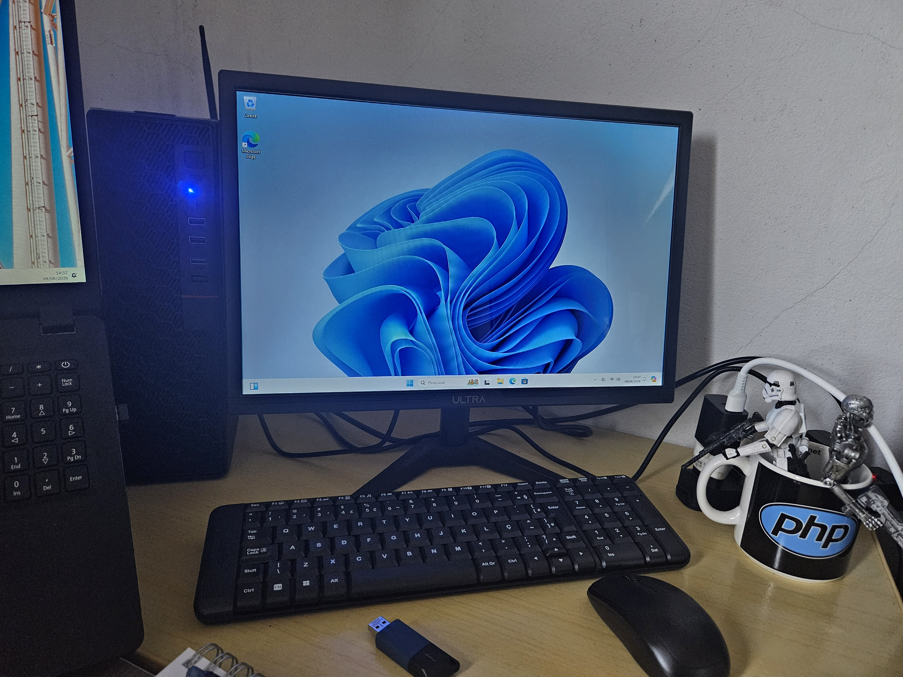

## Distribution selection

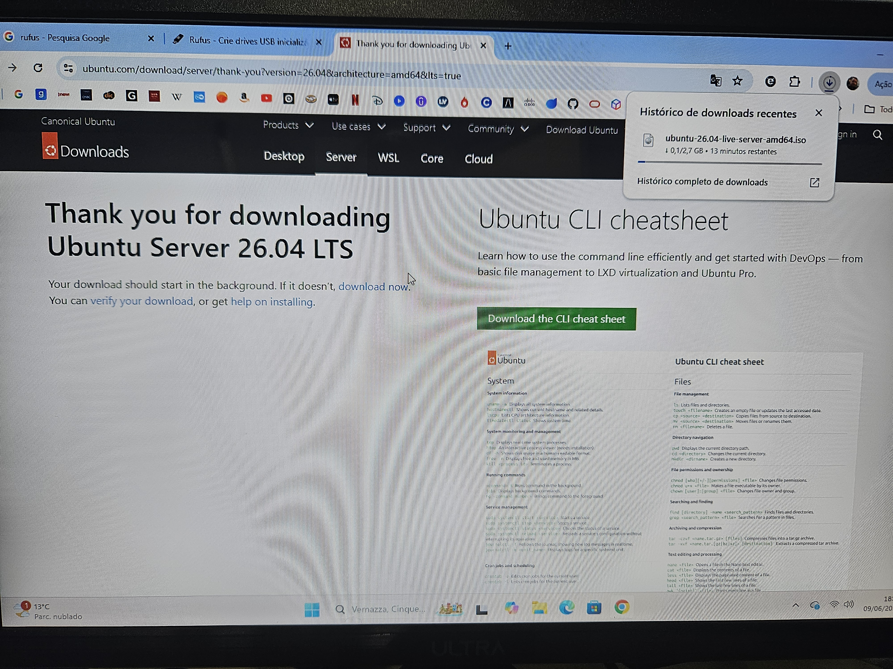

## Partitioning

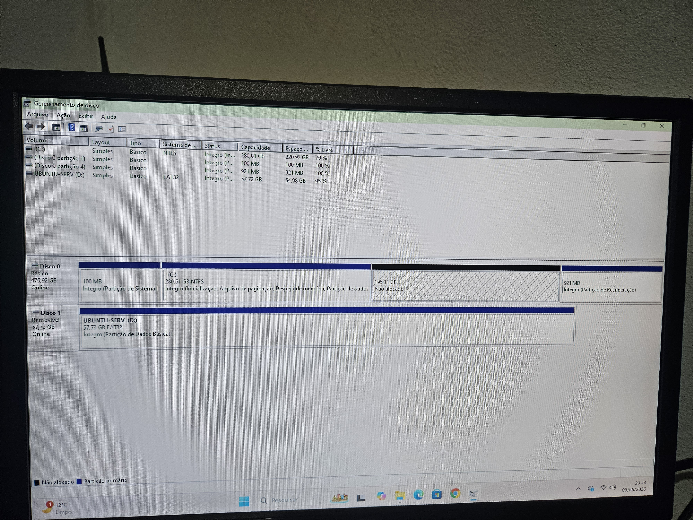

## Ubuntu Server Installation

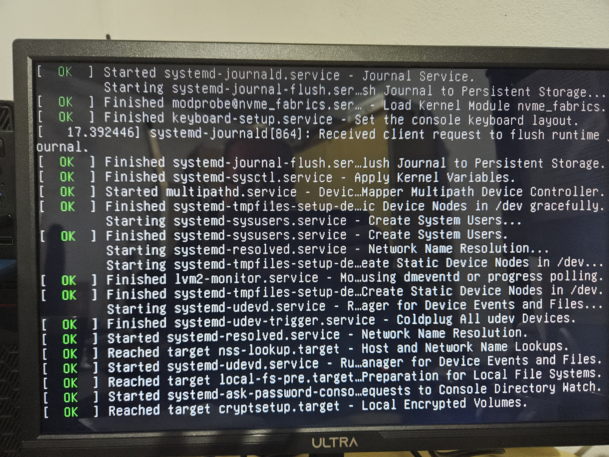

## First Login

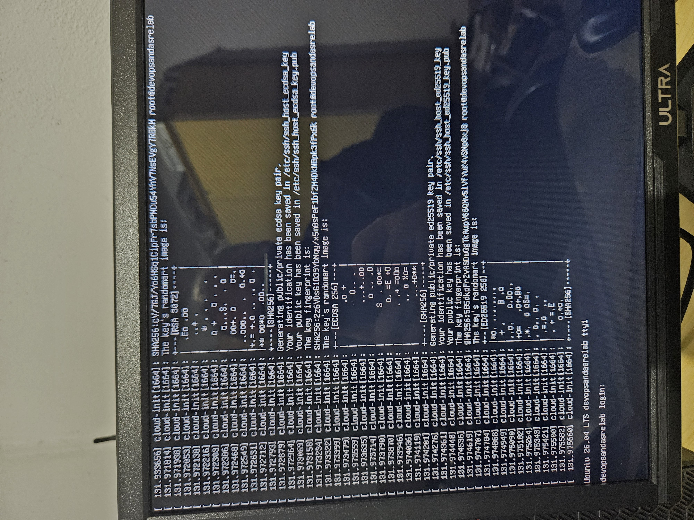

## Finalization

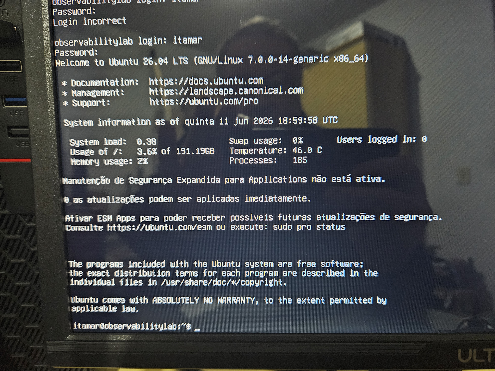

## Network Troubleshooting

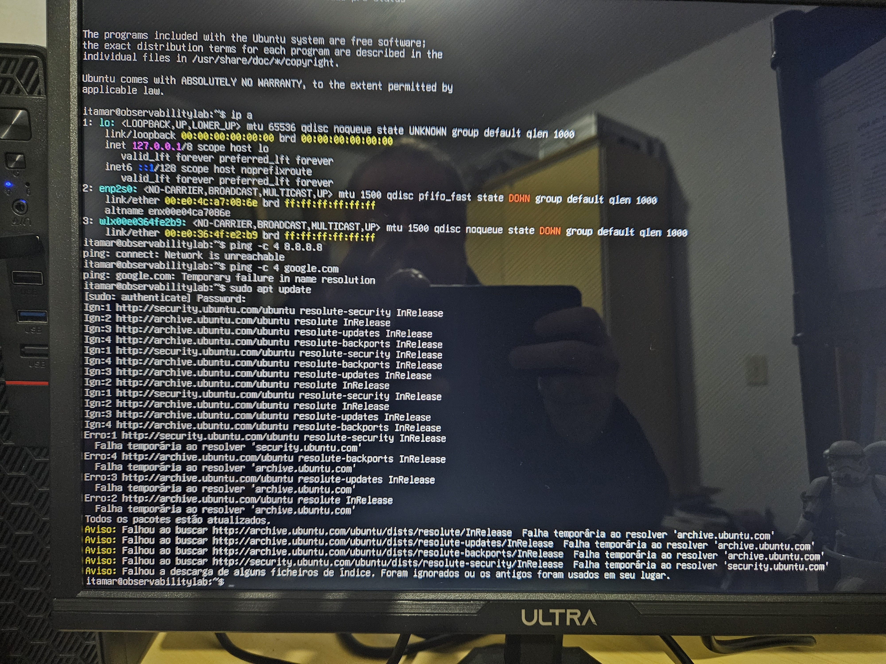

## Internet Access Verification

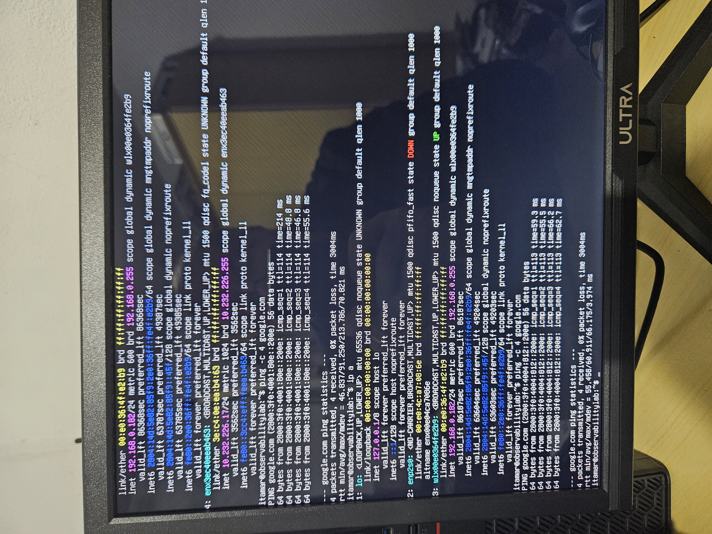

## Validation

```bash
ping google.com
```

## Result:

- 0% packet loss
- Successful DNS resolution
- Internet connectivity confirmed

## Updates Installed

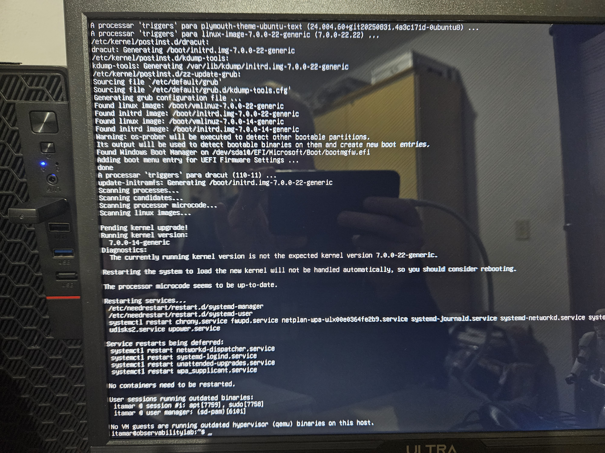

## Completely update the system:

```bash
sudo apt update
sudo apt upgrade -y
```

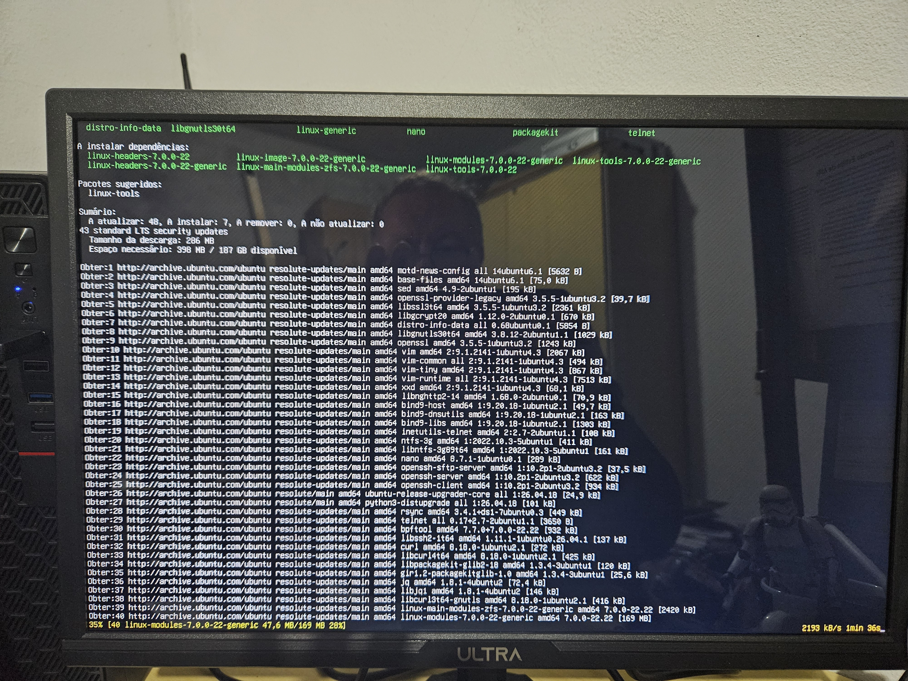

## Then:

```bash
sudo reboot
```

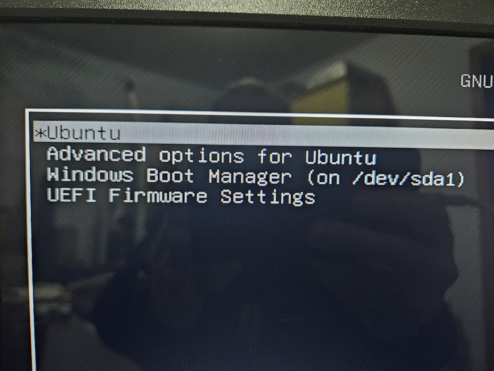

## After restarting:

```bash
uname -a
```

## And:

```bash
hostnamectl
```

