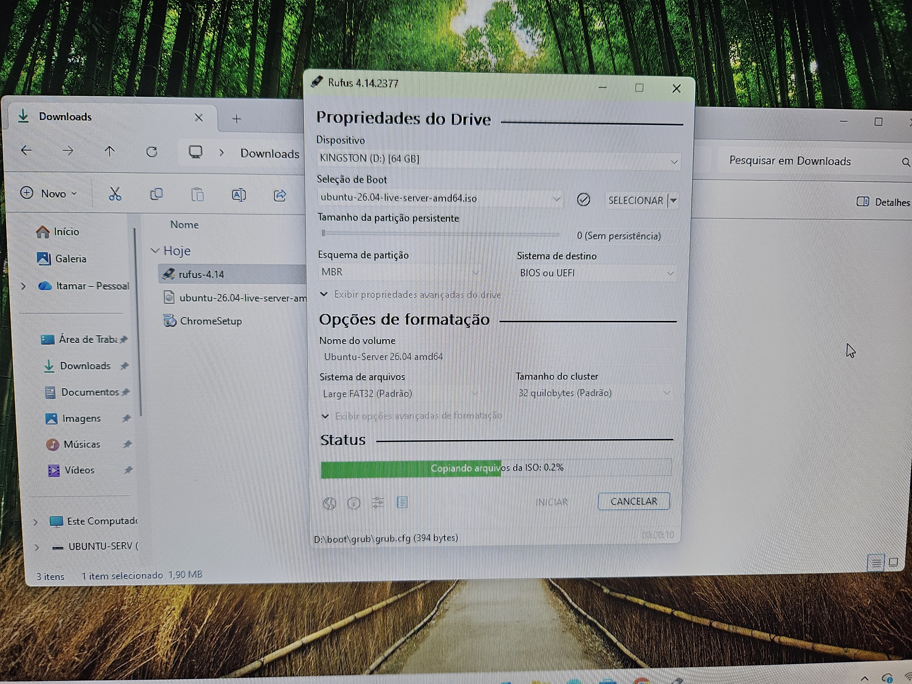
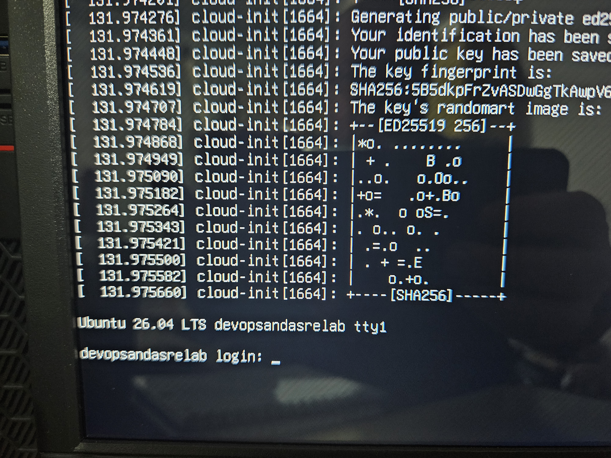

# Ubuntu Server Installation

## Objective

Prepare the laboratory environment for the Observability Engineering Framework.

## Hardware

- Mini PC
- Intel Core i7
- 16 GB RAM
- SSD 480 GB

## Operating System

Ubuntu Server LTS

## Planned Services

- NGINX
- FastAPI
- OpenTelemetry Collector
- Prometheus
- Grafana
- Loki
- Tempo

## Status

- [X] Ubuntu Installed
- [ ] Static IP Configured
- [ ] SSH Enabled
- [ ] Updates Installed

# Laboratory Evidence

## Hardware Lab

## Distribution selection

## Partitioning

## Ubuntu Server Installation

## First Login

## Finalization

